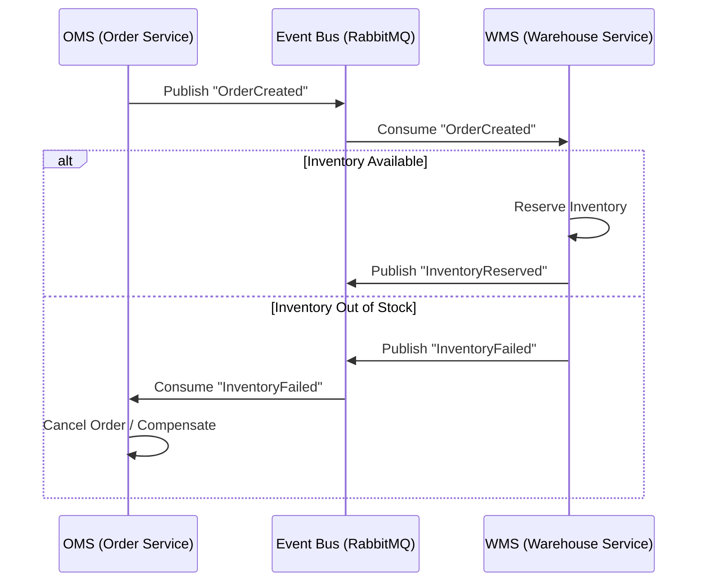
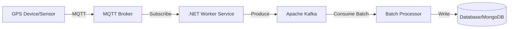
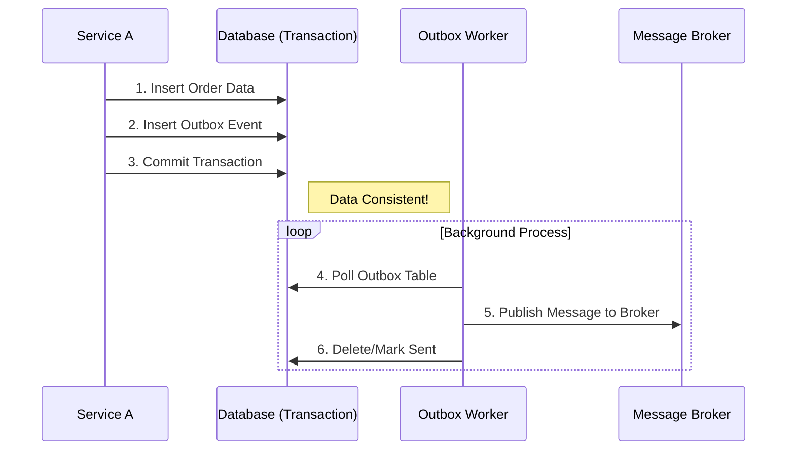

# Architecture Flows (Mô Hình Kiến Trúc & Tích Hợp)

## 2. Mô Hình Kiến Trúc: Event-Driven Microservices

Chúng ta sẽ từ bỏ mô hình Monolithic (Nguyên khối) để chuyển sang Microservices. Tuy nhiên, thay vì chỉ gọi API qua lại (gây tắc nghẽn), các services sẽ giao tiếp qua Sự kiện (Events).

### 2.1. Cơ chế vận hành luồng dữ liệu biến động

#### Xử lý Trạng thái Đơn hàng (Order State - Saga Pattern)

Sử dụng **Saga Pattern** (được hỗ trợ mạnh mẽ bởi thư viện MassTransit trong .NET).

**Luồng Xử Lý:**

1.  **OMS** tạo đơn -> Bắn sự kiện `OrderCreated`.
2.  **WMS** nhận sự kiện -> Giữ tồn kho (`Reserve Inventory`).
    - Nếu kho hết hàng -> Bắn sự kiện `InventoryFailed`.
3.  **OMS** nhận `InventoryFailed` -> Tự động hủy đơn hoặc điều hướng sang kho khác (**Compensating Transaction**).

**Lợi ích:** Đảm bảo tính nhất quán dữ liệu (Consistency) giữa các hệ thống phân tán.

#### Xử lý Tọa độ GPS & IoT (Real-time High Frequency)

Dữ liệu GPS từ hàng ngàn xe gửi về liên tục (ví dụ: 5 giây/lần). Không ghi trực tiếp vào DB chính (SQL).

**Luồng Xử Lý:**
Thiết bị -> MQTT Broker -> .NET Worker Service -> Kafka -> Xử lý hàng loạt (Batch Processing) -> DB.

- Sử dụng **.NET Minimal APIs + AOT** để tạo các service nhận tin siêu nhẹ, khởi động nhanh và chịu tải cao.

#### Xử lý Tồn kho (Inventory)

- Sử dụng cơ chế **Distributed Lock (Khóa phân tán)** trên Redis.
- Khi có đơn hàng, hệ thống khóa tạm thời số lượng hàng đó lại. Đảm bảo tại một thời điểm, món hàng đó không thể bị bán cho 2 người khác nhau (tránh Overselling).

## 6. Khả Năng Tích Hợp & IoT

### 6.1. Thiết bị GPS & Cảm biến

- Các thiết bị định vị (Blackbox) trên xe sẽ bắn dữ liệu qua giao thức **MQTT** (nhẹ hơn HTTP, giữ kết nối tốt).
- Hệ thống Backend có các "**IoT Gateway Services**" viết bằng .NET để lắng nghe các topic MQTT này.
- **Cảnh báo nóng:** Nếu cảm biến nhiệt độ báo > ngưỡng cho phép (hàng đông lạnh), Service sẽ bắn ngay lập tức notification qua **SignalR** tới Dashboard.

### 6.2. Tích hợp Đối tác (3PL)

- Xây dựng lớp **Anti-Corruption Layer (ACL)**.
- Ví dụ: API nội bộ gọi `CreateOrder`, lớp ACL sẽ dịch nó thành API của GHTK, GHN, ViettelPost tùy theo đối tác được chọn. Điều này bảo vệ hệ thống Core không bị sửa đổi khi đối tác đổi API.

## 7. Các Pattern Nâng Cao (Reliability Patterns)

Để đảm bảo hệ thống "không bao giờ sai sót" về dữ liệu.

### 7.1. Message Idempotency (Tính luỹ đẳng)

- **Vấn đề:** Mạng lag khiến Broker gửi lại message cũ (Duplicate Delivery). Nếu không xử lý, 1 đơn hàng sẽ bị trừ kho 2 lần.
- **Giải pháp:** Bảng `InboxState` trong Database của Consumer. Trước khi xử lý message, check xem `MessageId` đã tồn tại chưa.

### 7.2. Outbox Pattern

- **Vấn đề:** Lưu DB thành công nhưng bắn Event thất bại (hoặc ngược lại). Dẫn đến sai lệch dữ liệu.
- **Giải pháp:** Ghi Event vào bảng `Outbox` cùng transaction với Business Data. Sau đó một Worker sẽ đọc bảng này gửi đi. MassTransit hỗ trợ sẵn Outbox Pattern.

