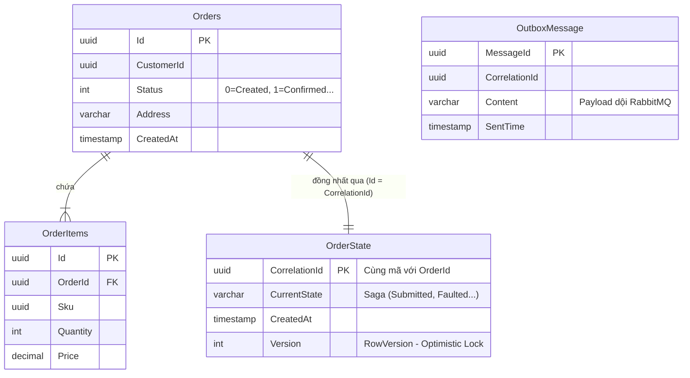
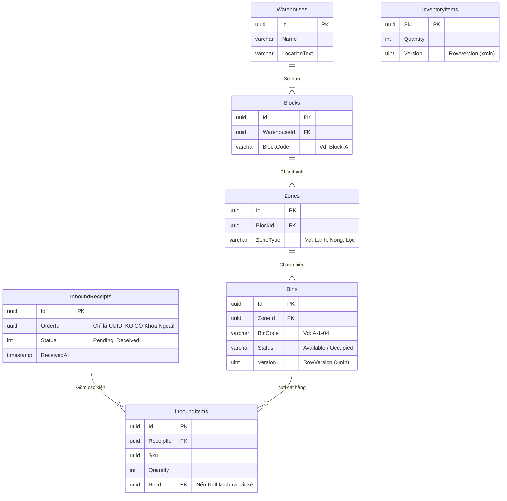

# 🏛️ Kiến Trúc Database & Lược Đồ Chi Tiết (Schema)

*Lần chỉnh sửa cuối: 20-03-2026*

Trong hệ thống LMS, chúng ta tuân thủ nguyên tắc **Microservices Data Sovereignty (Chủ quyền dữ liệu)**. Mỗi Microservice sở hữu một lược đồ (Schema) hoàn toàn độc lập, sử dụng **PostgreSQL 16**.

---

## 📦 1. Database Đơn Hàng & Điều Phối (`lms_oms_db`)

Database này là trung tâm điều hòa của toàn bộ vòng đời Đơn hàng, đồng thời làm "Nhạc trưởng" Saga thông qua bảng `OrderState`.

### 📊 Lược đồ Thực thể Kết hợp (ERD)

### 📋 Chi Tiết Cấu Trúc Bảng Lõi

1. **`Orders` & `OrderItems`**: Tổ hợp **Aggregate Root** lưu trữ yêu cầu ban đầu của khách hàng. Không chứa tồn kho hay vị trí lưu trữ.
2. **`OrderState`**: Bảng điều phối **Saga MassTransitStateMachine**. Cột `Version` được cấu hình `ConcurrencyMode.Optimistic` để tránh 2 dịch vụ giành giật việc Update trạng thái đơn cùng lúc.
3. **Các Bảng Hạ Tầng Khác (MassTransit Tự Tạo)**: Đi cùng OutboxMessage còn có `OutboxState` và `InboxState` (Idempotency chống trùng nhận sự kiện).

---

## 🏭 2. Database Quản Trị Kho Bãi (`lms_wms_db`)

Database này cực kỳ phức tạp về cấu trúc phân nhánh không gian kho lưu trữ và bảo vệ Tồn kho bằng Optimistic Concurrency Control.

### 📊 Lược đồ Thực thể Kết hợp (ERD)

### 📋 Thiết Kế Kẽ Hở Của Lược Đồ Này

1. **Hierarchy Vật Lý (Kho bãi)**: Cây gia phả `Warehouses -> Blocks -> Zones -> Bins` cho phép quản trị viên tìm kiếm kệ trống nhanh chóng bằng Tree-Query. Bins là nơi có cột `Version` để chặn thao tác giành khay chứa từ 2 nhân viên mâu thuẫn nhau.
2. **Hàng Hóa (`InventoryItems`)**: Lưu tổng lượng tồn kho theo Sku. Quan trọng nhất là cột `Version` (tương đương `xmin` của PostgreSQL) phục vụ EF Core Optimistic Concurrency. Khi hàm `Deduct(quantity)` được 2 người gọi cùng nhịp miliseconds, 1 lệnh sẽ bị dìm thành lỗi `DbUpdateConcurrencyException`.
3. **Luật ngầm bứt khóa ngoại**: Bảng `InboundReceipts` ở WMS lưu cột `OrderId` Của hệ thống OMS. Tuy nhiên, nó chỉ lưu mặt chữ UUID (Soft-link), TUYỆT ĐỐI KHÔNG cài Foreign Key băng qua 2 Microservices.

---

## 🔐 3. Lược Đồ Chống Cận (Caching & Security)

- **`keycloak_db` (PostgreSQL)**: Toàn bộ bảng `Users`, `Roles`, `Realm` nằm gọn trong này do Hệ thống RedHat Keycloak tự sinh ra theo chuẩn SSO OIDC. Team Dev Backend bị cấm đọc/ghi trực tiếp vào Schema này.
- **`lms-redis` (Docker)**:
  - Cache các Query tra cứu mã Zipcode / Bảng giá vận tải (TTL ~ 2 tiếng).
  - Rate Limiter Storage cho YARP Gateway (Quy định 1 IP Guest được chọc tối đa 100 req/min).
