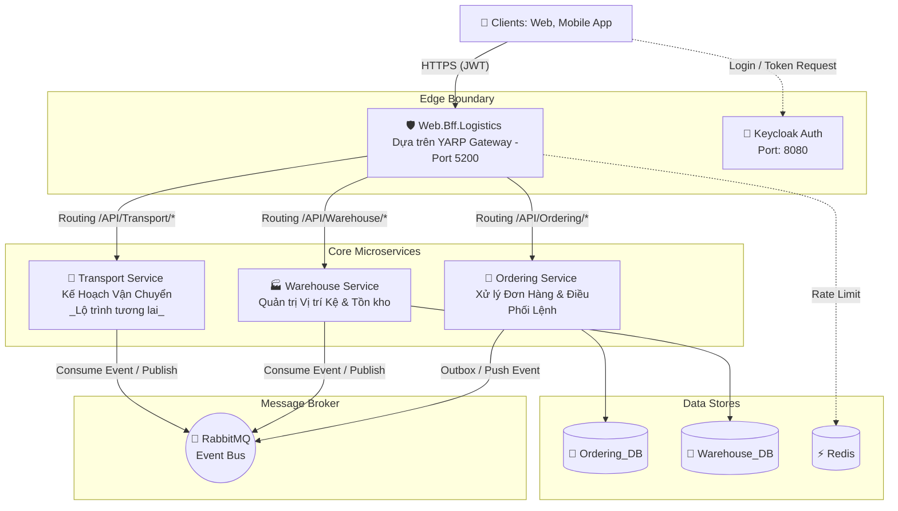
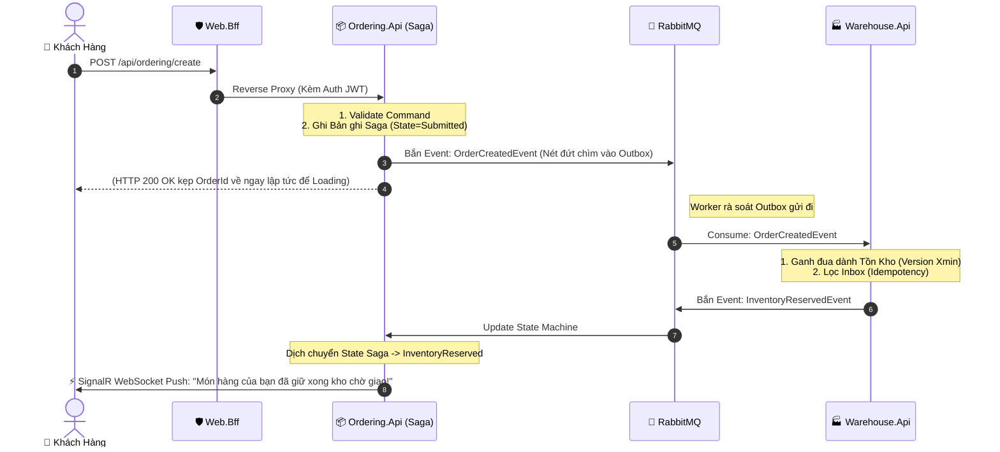

# 🏗️ Kiến Trúc Hệ Thống Toàn Cảnh (System Architecture)

*Lần chỉnh sửa cuối: 20-03-2026*

Tài liệu này cung cấp bức tranh gốc rễ (Big Picture) của Hệ thống Logistics Management System (LMS). Nền tảng này vừa trải qua đợt Tái Cấu Trúc Toàn Diện (Refactoring) theo mô hình Monorepo Chuẩn Mực của Microsoft.

---

## 🚀 1. Tổng Quan (Executive Summary)

**Logistics Management System (LMS)** là một nền tảng vận hành kho bãi và vận tải được xây dựng theo kiến trúc **Event-Driven Microservices**. 
- **Tech Stack:** `.NET 8` (Backend), `PostgreSQL 16` (Database), `RabbitMQ` (Message Broker), `Redis` (Caching & Throttling).
- **Security:** Quản lý truy cập tập trung qua phân hệ OIDC của **RedHat Keycloak** (JWT Bearer Token).
- **Core Pattern:** Giao tiếp bằng `MediatR (CQRS)`, `Saga Orchestration` qua MassTransit State Machine, và `SignalR WebSockets` cho thông báo thời gian thực.
- **Hosting:** Môi trường Dev/Test cài qua `Docker Compose` (thư mục `deploy`). Production cài qua `Kubernetes`.

---

## 🏛️ 2. Kiến Trúc Tổng Thể (High-Level Architecture)

Nền tảng được cấu thành từ các Bounded Contexts định danh chuẩn xác theo **Domain-Driven Design (DDD)** thay vì các từ viết tắt kỹ thuật (OMS, WMS):



---

## 🎯 3. Chi Tiết Các Lớp Bên Trong 1 Microservice (Clean Architecture 4 Layers)

Mỗi Microservice (ví dụ `Ordering`) ĐỀU PHẢI chẻ ra 4 dự án con (`.csproj`) tách biệt để khóa vĩnh viễn giới hạn địa lý của Code (Dependency Rule).

| Tên Dự án (Layer) | Chức năng (Trách nhiệm) |
| :--- | :--- |
| **1. Domain** | Trái tim nghiệp vụ. Chứa `Entities`, `Value Objects`, `Domain Events`. Nơi chứa các thuật toán cốt tử của ứng dụng (Status Đơn hàng, Tính chiết khấu...). Không được trỏ tham chiếu đến tầng nào khác. |
| **2. Application** | Tầng Điều phối Use Cases. Cắm rễ với **MediatR**. Nhận Input, Validate lỗi, triệu hồi Repository lấy Entity ra, gọi hàm ở Entity, và cất lại vào Repository. |
| **3. Infrastructure** | Tầng làm mướn (Worker). Triển khai các Interface của `Application`. Chứa Code gắn chặt công nghệ: `Entity Framework (DbContext)`, bảng `Outbox`, setup cấu hình Server RabbitMQ. |
| **4. Api (Presentation)** | Lễ tân tiếp khách (REST Endpoint, Minimal API, gRPC, SignalR). Gói Input thành Payload, quăng cho MediatR/Application xử lý. |

---

## 🌊 4. Sơ Đồ Data Flow -- Kịch Bản Saga Trọng Yếu

*Hành trình Tạo Đơn Hàng từ App $\rightarrow$ Quét Tồn Kho $\rightarrow$ Thông Báo Live.*



---

## 🐳 5. Sơ Đồ Deployment Cục Bộ (Docker Compose)

Hệ thống được gói gọn trong thư mục `deploy/docker` để giả lập môi trường Server thực tế.

```mermaid
flowchart LR
    subgraph Host[Máy DEV Local (Windows/Mac)]
        Browser[Trình Duyệt Trải Nghiệm]
    end

    subgraph DockerNet[Mạng Docker Local: lms-network]
        direction TB
        
        API_GW[web.bff.logistics : 5200]
        API_ORD[ordering.api : 5000]
        API_WMS[warehouse.api : 5001]
        
        DB_PG[(postgres : 5432)]
        MQ_RABBIT((rabbitmq : 5672))
        REDIS[(redis : 6379)]
        KC[keycloak : 8080]
        JG[jaeger : 16686]
        
        API_GW --> API_ORD
        API_GW --> API_WMS
        
        API_ORD --> DB_PG
        API_ORD --> MQ_RABBIT
        API_WMS --> DB_PG
        API_WMS --> MQ_RABBIT
    end
    
    Browser -- "http://localhost:5200" --> API_GW
    
    subgraph Volumes[Persisted Volumes trên Ổ cứng thật]
        VB[pg-data]
        VR[rabbit-data]
        DB_PG -. Ánh xạ .-> VB
        MQ_RABBIT -. Ánh xạ .-> VR
    end
```

---

## 🗂️ 6. Cấu Trúc Monorepo Định Hình Của Dự Án

Cây thư mục của Team được tổ chức cực kì sạch sẽ, gom nhóm các khối chức năng vào Folder tương ứng, triệt tiêu mọi mầm mống hỗn loạn (Spaghetti Structure).

```text
D:\Logistics\ (Gốc dự án)
├── 📂 .github                  # CI/CD Pipelines (Github Actions)
├── 📂 deploy                   # Hạ tầng Server vật lý / Docker
│   └── 📂 docker               
│       ├── docker-compose.local.yml
│       └── docker-postgres-init.sql
├── 📂 docs                     # Thư viện Knowledge Base
│   ├── 📂 checklist            # 14 Lesson Training (Khóa học nội bộ)
│   ├── db_architecture.md      # Quy hoạch Database chi tiết
│   └── system_architecture.md  # File kiến trúc tổng quan (bạn đang xem)
│
├── 📂 src                      # Source Code Hệ Sinh Thái
│   ├── 📂 ApiGateways          # Lớp áo giáp cổng ngoài cùng
│   │   └── 📂 Web.Bff.Logistics
│   │
│   ├── 📂 BuildingBlocks       # Cốt thép nền móng cắm mốc
│   │   ├── EventBus.Messages   # Toàn bộ "Sự Kiện - Messages" luân chuyển RabbitMQ
│   │   └── Logistics.Core      # Định nghĩa Aggregate Root, Result Pattern
│   │
│   ├── 📂 Services             # Quân đoàn dịch vụ độc lập
│   │   ├── 📂 Ordering         # Service Đơn hàng & Saga Orchestrator
│   │   │   ├── Ordering.Api
│   │   │   ├── Ordering.Application
│   │   │   ├── Ordering.Domain
│   │   │   └── Ordering.Infrastructure
│   │   ├── 📂 Warehouse        # Service Kho Bãi, Kệ Khía, Tồn Kho
│   │   │   └── (...)
│   │
│   └── LMS.sln                 # File chụm toàn bộ các mảng code vào Visual Studio
│
└── 📂 tests                    # Bãi test nghiệm thu (Vô hình ở Production)
    └── 📂 Services
        ├── 📂 Ordering
        │   ├── Ordering.Domain.UnitTests
        │   └── Ordering.Application.UnitTests
        └── 📂 Warehouse
            └── Warehouse.Domain.UnitTests
```

Chuẩn mực này đáp ứng toàn diện tiêu chí: **Clean Code**, **Testability**, và **Scalability** lên tới mức vô hạn của hệ thống Microservices doanh nghiệp.
