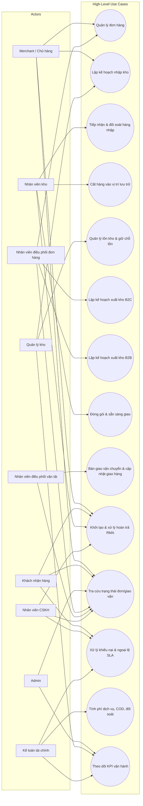

# High-Level Use Cases + Actors (User Interaction Only)

> Phạm vi: chỉ các use case mà **con người** tương tác trực tiếp với hệ thống.  
> Loại trừ: thiết bị phần cứng, cổng bảo vệ/gate, và các xử lý hệ thống nội bộ không có thao tác người dùng.

## 1) Actors

### External Actors
- **Merchant / Chủ hàng**
- **Khách nhận hàng (Consignee/B2B Customer)**

### Internal Actors
- **Admin / Quản trị hệ thống**
- **Nhân viên điều phối đơn hàng**
- **Nhân viên kho**
- **Quản lý kho**
- **Nhân viên điều phối vận tải**
- **Nhân viên CSKH**
- **Kế toán tài chính**

---

## 2) High-Level Use Cases (Business)

1. Quản lý đơn hàng (tạo/xem/xác nhận/hủy)
2. Lập kế hoạch nhập kho
3. Tiếp nhận và đối soát hàng nhập
4. Cất hàng vào vị trí lưu trữ
5. Quản lý tồn kho và giữ chỗ tồn
6. Lập kế hoạch xuất kho B2C
7. Lập kế hoạch xuất kho B2B
8. Xử lý đóng gói và sẵn sàng giao
9. Bàn giao vận chuyển và cập nhật giao hàng
10. Khởi tạo và xử lý hoàn trả (RMA)
11. Tra cứu trạng thái đơn/giao vận
12. Xử lý khiếu nại & ngoại lệ SLA
13. Tính phí dịch vụ, COD, đối soát
14. Theo dõi KPI vận hành

---

## 3) Mermaid (Actor ↔ Use Case Mapping)

---

## 4) Notes
- Sơ đồ này thể hiện **tương tác người dùng với hệ thống** ở mức nghiệp vụ cao.
- Không mô tả integration nội bộ giữa các service.
- Không đưa vào actor dạng thiết bị hoặc hạ tầng vật lý.
