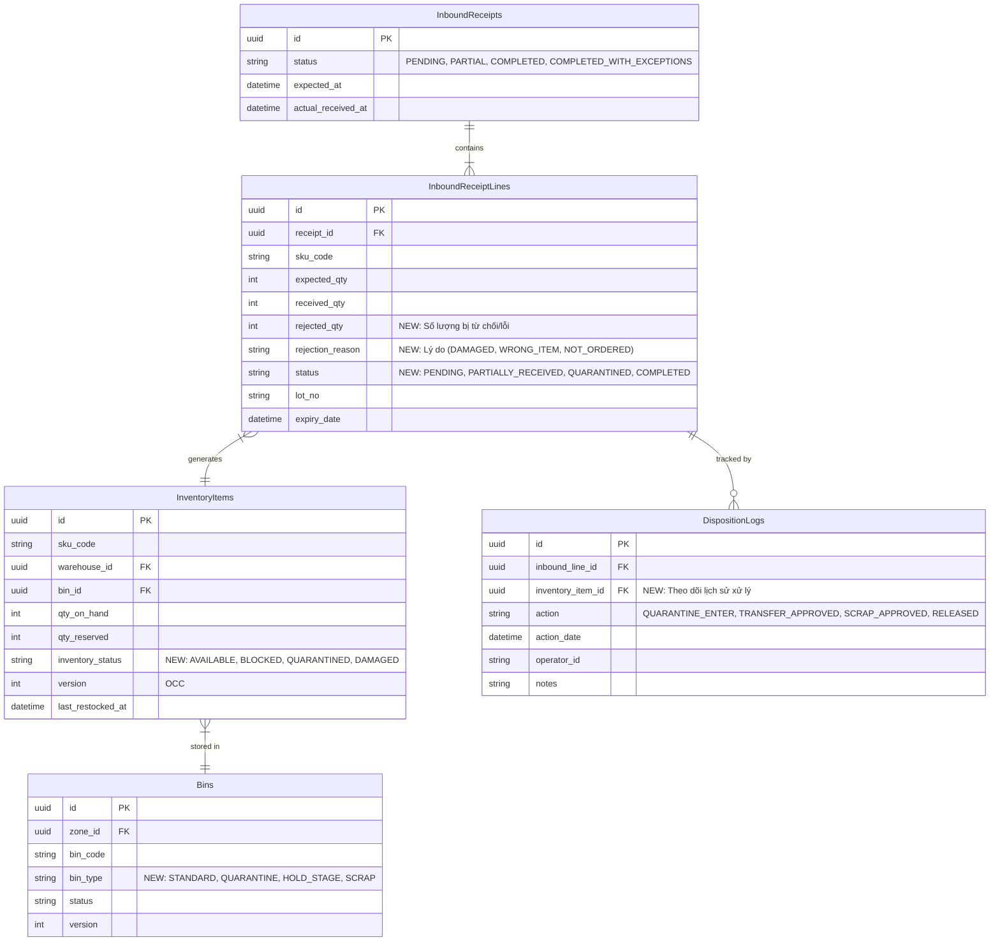

# Warehouse Exception Management Schema (ERD)

Sơ đồ dưới đây mở rộng cấu trúc cơ sở dữ liệu hiện tại để hỗ trợ quy trình xử lý ngoại lệ khi nhập kho (Inbound Receipt Exceptions) như đã thống nhất (hàng hỏng, sai lệch số lượng, chuyển vào Quarantine/RTV).

### Các Thay Đổi Chính Theo Mô Hình 3PL:
1. **`InboundReceiptLines`**: 
   - Thêm `rejected_qty` và `rejection_reason` để ghi nhận trực tiếp trên Line số hàng bị lỗi lúc dỡ container/xe tải.
2. **`InventoryItems`**: 
   - Thay `RTV` bằng `DAMAGED`. 3PL không có quyền tự ý trả hàng cho Vendor. Hàng hỏng được đánh dấu `DAMAGED` để hệ thống WMS tuyệt đối không cấp phát (allocate) cho đơn hàng B2C/B2B đi người mua cuối, nhưng vẫn cho phép xuất luân chuyển (Transfer Order) sang kho khác.
3. **`Bins`**:
   - Thay `RTV_STAGE` bằng `HOLD_STAGE`. Đây là khu vực tập kết tạm để chờ đưa lên xe tải xuất đi kho xử lý tập trung hoặc kho khác theo lệnh của Client.
4. **`DispositionLogs` (Thay cho QuarantineLogs)**:
   - Dùng để lưu vết quá trình ra quyết định của Chủ hàng (Client) đối với hàng lỗi.
   - `TRANSFER_APPROVED`: Lệnh xuất luân chuyển đi kho khác.
   - `SCRAP_APPROVED`: Lệnh tiêu hủy tại chỗ.
   - `RELEASED`: Lệnh tái nhập kho (hàng không sao cả, xước nhẹ, vẫn bán được).
