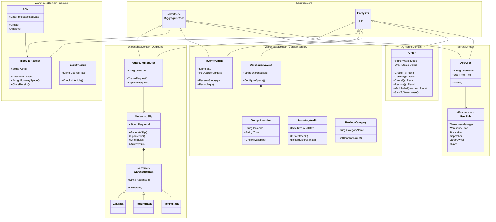

# Logistics Management System - Class Diagram Design Plan

## 1. System Architecture & Methodology

The system is implemented using a **Microservices Architecture** with a strong emphasis on **Domain-Driven Design (DDD)**. 
To satisfy the full scope of the Use Case diagrams while maintaining technical accuracy, the class design is mapped into specialized **Bounded Contexts** (microservices):
- **Identity Service**: Manages actors and authorization.
- **Ordering Service (OMS)**: Manages the end-to-end delivery lifecycle.
- **Warehouse Service (WMS)**: Handles configuration, inbound, outbound, and physical inventory stock.

### Shared Kernel / Core Abstractions (`Logistics.Core`)
- `Entity<T>`: Base class providing identity (`Id`).
- `IAggregateRoot`: A marker interface denoting entry points for consistency boundaries.
- `ValueObject`: Base class for immutable domain concepts.
- `Result` / `Result<T>`: Standardized response wrapper.

---

## 2. Extended Domain Models (Microservices Implementation)

To fulfill all the Use Cases defined in the visual diagrams, we plan the following aggregates and entities across the microservices.

### 2.1. Identity Service (`Identity.Domain`)
*Validates the actors derived from the Use Case Diagram.*
**Entities & Enums:**
- `AppUser` (Aggregate Root): Represents the system user.
  - **Attributes**: `Username`, `Email`, `Role`.
- `UserRole` (Enum): Distinguishes permissions: `WarehouseManager` (Quản lý kho), `WarehouseStaff` (Nhân viên kho), `Stocktaker` (Nhân viên kiểm kê), `Dispatcher` (Nhân viên điều phối), `CargoOwner` (Chủ hàng), `Shipper`, `ITAdmin`.

### 2.2. Ordering Service (`Ordering.Domain` - OMS)
*Fulfills the Use Cases: Lên đơn hàng, Cập nhật trạng thái, Xử lý giao hàng thất bại, Xử lý/Khôi phục đơn hủy, Đẩy đơn về kho...*
**Entities:**
- `Order` (Aggregate Root): 
  - **Attributes**: `WaybillCode`, `Status`, `CodAmount`, `DeliveryAttempts`, `FailureReason`.
  - **Methods**: `Create()`, `Confirm()`, `Cancel()`, `Restore()`, `MarkDispatched()`, `MarkDelivered()`, `MarkFailed(reason)`.
- `OrderStatus` (Enum): Tracking lifecycle states.
- `Consignee` & `Address` (Value Objects).

### 2.3. Warehouse Service (`Warehouse.Domain` - WMS)
*Fulfills the vast WMS Use Cases: Configuration, Inbound, Outbound, and Stock Management.*

**Context: Configuration (Quản lý cấu hình kho bãi)**
- `WarehouseLayout` (Aggregate Root): 
  - **Methods**: `ConfigureSpace()`, `GetCapacitySummary()`.
- `StorageLocation` / `Bin` (Entity):
  - **Attributes**: `LocationId`, `Zone`, `Barcode`, `MaxWeight`, `Status`.
  - **Methods**: `UpdateStatus()`, `CheckAvailability()`.

**Context: Inbound Management (Quản lý nhập kho)**
- `ASN` (Advance Shipping Notice - Aggregate Root): Tạo đơn thông báo vận chuyển trước.
  - **Attributes**: `AsnId`, `ExpectedDate`, `OwnerId`.
  - **Methods**: `Create()`, `Approve()`.
- `DockCheckIn` (Entity): Check-in xe đến và phân bến.
  - **Methods**: `CheckInVehicle(licensePlate)`, `AssignDock()`.
- `InboundReceipt` (Phiếu nhập kho - Aggregate Root): Tạo & Đóng phiếu nhập.
  - **Attributes**: `ReceiptId`, `AsnId`, `Status`.
  - **Methods**: `Generate()`, `ReconcileGoods()` (Đối soát), `AssignPutawaySpace()` (Chuẩn bị không gian & sắp xếp vào kho), `CloseReceipt()`.

**Context: Outbound Management (Quản lý xuất kho)**
- `OutboundRequest` (Yêu cầu xuất kho - Aggregate Root): Tạo/Phê duyệt yêu cầu.
  - **Methods**: `CreateRequest()`, `ApproveRequest()`.
- `OutboundSlip` (Phiếu xuất kho - Aggregate Root): Tạo/Cập nhật/Xóa/Duyệt phiếu xuất.
  - **Methods**: `GenerateSlip()`, `UpdateSlip()`, `DeleteSlip()`, `ApproveSlip()`.
- `WarehouseTask` (Abstract Entity): Base for concrete execution tasks.
  - Subclasses: `PickingTask` (Lấy hàng, Chuẩn bị hàng hóa), `PackingTask` (Đóng gói), `VASTask` (Gia công hàng hóa mở rộng).
  - **Methods**: `AssignStaff()`, `Complete()`.

**Context: Storage & Inventory (Quản lý lưu trữ & Tồn kho)**
- `InventoryItem` (Aggregate Root): Tra cứu tồn kho.
  - **Attributes**: `Sku`, `QuantityOnHand`, `ReservedQty`.
  - **Methods**: `ReserveStock()`, `ConfirmStockDeduction()`, `Restock()`.
- `InventoryAudit` (Kiểm kê kho - Aggregate Root): 
  - **Attributes**: `AuditId`, `Date`, `Variance`.
  - **Methods**: `InitiateCheck()`, `RecordDiscrepancy()`, `ApproveAdjustment()`.
- `ProductCategory` (Entity): Phân loại và sắp xếp hàng hóa.
  - **Methods**: `GetHandlingRules()`.

---

## 3. Class Diagram (Mermaid)

Below is the Class Diagram representing the targeted microservice architecture capable of supporting all outlined Use Cases.

## 4. Architectural Notes
- The model ensures that the **Architecture accurately supports the Conceptual Use Cases**. Features that are not yet implemented in the source code (like `InboundReceipt` and `OutboundSlip`) are fully designed here under their appropriate bounded contexts to guide future development.
- The separation between `Order` (OMS) and `WarehouseRequest / ASN` allows the system to decouple external customer logistics tracking from internal physical warehouse maneuvers.
