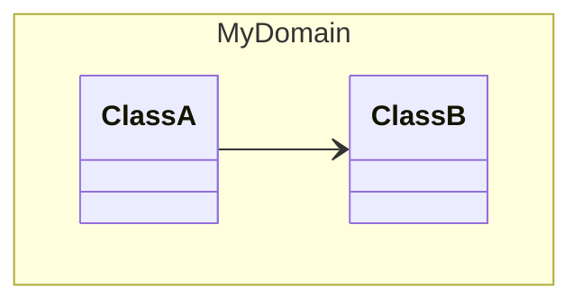

# Skill: Handle Mermaid Class Diagram Namespace Relationship Errors

## Description
When creating a `classDiagram` in Mermaid.js, you might encounter an `Expecting 'STRUCT_STOP', 'CLASS', got 'ALPHA'` parsing error if you declare relationship lines (e.g., `-->`, `*--`, `<|--`) inside a `namespace { ... }` block.

## The Error
```text
Error: Parse error on line X:
...sA } ClassA --> ClassB
---------------------^
Expecting 'STRUCT_STOP', 'CLASS', got 'ALPHA'
```

## Root Cause
Mermaid's current parser requires all classes inside a `namespace` to be defined purely by their structure/attributes/methods. It **does not** support drawing relationship links within the `namespace { ... }` curly braces. 

## Solution
1. Extract all relationships from your `namespace` blocks.
2. Group the relationship declarations at the root level of the diagram (usually best placed at the bottom for readability).

### Wrong Pattern ❌
```mermaid
classDiagram
    namespace MyDomain {
        class ClassA
        class ClassB
        ClassA --> ClassB   %% <--- Causes Parse Error
    }
```

### Correct Pattern ✅


## Takeaway / AI Instruction
Whenever generating a `classDiagram` using Mermaid blocks, always do a final verification pass to ensure no relationship operators (`-->`, `<..`, `*--`, `o--`, `<|--`) are nested inside standard `namespace` definitions. Move them all to a dedicated `%% Relationships` section at the end of the diagram.
